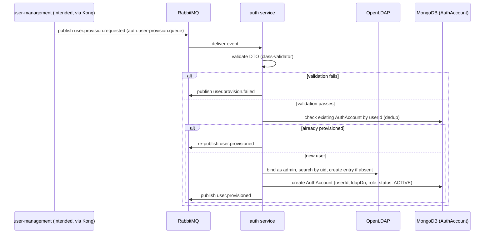

# Auth & User Registration Module — Implementation Report

**Project:** `uom-mis-backend` — NestJS microservices backend for the University of Moratuwa MIS
**Scope:** Event-driven user provisioning pipeline (`apps/auth`), plus the system-wide authentication architecture it now defers entirely to Kong + Keycloak
**Branch:** `feature/auth`
**Report date:** 2026-07-21

---

## 1. Purpose & Scope

`auth`'s job is narrower than its name suggests, by design: it's a **provisioning worker**, not an authentication service. When a new user (student or staff) needs an account, a provisioning request event is published to RabbitMQ, `auth` consumes it, validates it, creates an identity in LDAP, records the outcome in MongoDB, and publishes a result event back onto the bus.

Authentication itself — login, token issuance, token validation — is explicitly **not** `auth`'s responsibility. That's owned by **Kong** (API gateway, enforces auth at the edge) and **Keycloak** (identity provider, authenticates against LDAP). See §5.

---

## 2. Architecture

### 2.1 Services involved

| Service | Role | Actual current state |
|---|---|---|
| `apps/auth` | Consumes provisioning requests, writes to LDAP/Mongo, publishes results | **Fully implemented** for this narrowed scope |
| `apps/user-management` | Intended to originate provisioning requests (via Kong) and consume result events | **Unmodified Nest boilerplate** — no provisioning logic exists |
| `apps/api-gateway` | Custom NestJS gateway scaffold | **Being superseded by Kong** — see §5.2. Still non-functional as-is (§6.3). |
| Kong | System-wide API gateway; Policy Enforcement Point for authentication | **Not yet built** — in progress, outside this repo's app code |
| Keycloak | Identity provider; authenticates via LDAP federation | Remote dev server (`auth-dev.uom.ac.lk`); **federation to this LDAP not yet confirmed configured** |
| LDAP (OpenLDAP) | Credential + identity store | Local Docker container, now defined in `docker-compose.yml` |

### 2.2 System-wide authentication architecture

Authentication is centralized at the gateway, not distributed across microservices:

```
Client ──► Kong (API Gateway) ──auth check──► Keycloak ──federation──► LDAP
              │
              └──(post-auth, proxied)──► user-management / notification / etc.
```

- **Kong** is the sole Policy Enforcement Point: it terminates the OIDC Authorization Code flow (redirects an unauthenticated browser to Keycloak's hosted login page), validates tokens/sessions on every subsequent request, and only then proxies to a backend service.
- **Keycloak** hosts the actual login page and issues tokens. It does **not** own passwords — it's configured with an **LDAP User Federation** provider pointing at the same OpenLDAP instance `auth` provisions into, so the real credential check is an LDAP bind.
- **Backend services** (`user-management`, `notification`, and `auth` itself) do not issue or verify JWTs. They trust Kong's enforcement completely and contain zero auth code — this was a deliberate decision to avoid duplicating auth logic per service.
- **`auth` never talks to Keycloak.** Keycloak learns about a newly-provisioned user lazily, the first time they log in through Kong — via LDAP federation import — not because `auth` pushes anything to it.

Two things this depends on that are outside this repo's code:
1. Someone must actually configure Keycloak's LDAP User Federation provider against this OpenLDAP instance — nothing works end-to-end without it.
2. Kong's officially supported OpenID Connect plugin is an **Enterprise** feature; Kong OSS needs a community plugin (e.g. `kong-oidc`) with rougher edges around session/logout handling. Which tier is available changes what's actually buildable and hasn't been confirmed yet.

### 2.3 Registration pipeline flow



Keycloak is not part of this flow at all — it's a deliberate, confirmed decision (Keycloak's Admin API cannot be used to create users in this setup; user discovery happens only via LDAP federation, on the login side).

### 2.4 Messaging details (exact names, from code)

- Inbound queue: `auth.user-provision.queue` (env `AUTH_QUEUE`), durable, manual ack (`noAck: false`)
- Inbound event pattern: `user.provision.requested`
- Outbound queue: `user-management.events.queue` (hardcoded literal in `events.module.ts`, **not** env-driven — inconsistent with the inbound queue's env-based config)
- Outbound event patterns: `user.provisioned`, `user.provision.failed`
- Broker URL: `RABBITMQ_URL` — now served by the `rabbitmq` service in `docker-compose.yml` (`amqp://localhost:5672`, management UI at `localhost:15672`)
- No exchanges declared anywhere — everything routes via default direct queue sends
- No dead-letter queue / retry policy: failed or invalid messages are `nack`'d with `requeue=false`, so they are **dropped permanently**, not retried or parked

---

## 3. Request validation

`apps/auth/src/auth-provision/dto/user-provision-requested.dto.ts` — unchanged from prior work:

| Field | Rule |
|---|---|
| `eventId`, `correlationId`, `userId` | required non-empty string |
| `email` | must pass `@IsEmail()` |
| `fullName`, `role` | required non-empty string |
| `address` | optional string |
| `regNumber` | **conditionally required** — `@ValidateIf(dto => dto.role === 'student')` + `@IsNotEmpty()` |

Validation runs in `AuthProvisionController.handleUserProvisionRequested` via `class-validator`'s `validate()`. On failure: logs the error, publishes `user.provision.failed` with a joined constraint-message string as `reason`, and `nack`s the message (dropped, not requeued).

---

## 4. Identity write — LDAP

`apps/auth/src/ldap/ldap.service.ts` (`ldapts` client) — unchanged:

- Connection config (`LDAP_URL`, `LDAP_BASE_DN`, `LDAP_USERS_OU`, `LDAP_ADMIN_DN`, `LDAP_ADMIN_PASSWORD`) read eagerly in the constructor via `getOrThrow`.
- DN constructed as `uid=<userId>,<LDAP_USERS_OU>`.
- **Idempotent create**: binds as admin, searches for an existing `(uid=...)` entry first; if found, returns the existing DN without writing.
- Entry attributes: `objectClass: [inetOrgPerson, organizationalPerson, person, top]`, plus `uid`, `cn`, `sn`, `givenName`, `mail` always; `postalAddress` (from `address`) and `employeeNumber` (from `regNumber`/staff ID) only if present.
- Password: hand-rolled **SSHA** hash (4-byte random salt, SHA-1 over `plaintext + salt`, `{SSHA}base64(digest+salt)`), matching the standard OpenLDAP `userPassword` scheme.
- The plaintext temporary password (`AuthProvisionService`, `randomBytes(9).toString('base64url')`) is **only logged**, never emailed or returned — explicitly dev-only behavior.

Local infra: `docker-compose.yml` (renamed from `docker-compose.ldap.yml`, now also runs RabbitMQ) — `osixia/openldap` (base DN `dc=uom-mis,dc=local`, admin `cn=admin,dc=uom-mis,dc=local`/`admin`) plus `phpldapadmin` on `localhost:6080`.

---

## 5. Authentication — deliberately out of `auth`'s scope

### 5.1 What was tried and reverted

A `POST /login` module (`apps/auth/src/login/`) was built at one point: took `{ email, password }`, called Keycloak's password grant directly via `@keycloak/keycloak-admin-client`, and returned Keycloak's tokens. This was **fully reverted** once the system architecture was clarified:

- Kong is meant to enforce authentication at the edge (redirect to Keycloak, validate tokens) — a login endpoint inside `auth` duplicates that.
- Keycloak's Admin API **cannot be used to create users** in this setup — confirmed during this work — so the parallel `KeycloakAdminService` (`createUserIfNotExists` + `assignRealmRole`) that mirrored users into Keycloak during registration was also removed entirely, along with all `KEYCLOAK_*` env vars, the `keycloakUserId` field on `AuthAccount`, and the `@keycloak/keycloak-admin-client` dependency.

`auth` now has no Keycloak-facing code whatsoever. Its only HTTP surface is `/health`.

### 5.2 Where auth logic actually lives now

- **Kong**: OIDC Authorization Code flow, token validation on every request, routing to backends. See §2.2.
- **Keycloak**: hosts the login page, authenticates via LDAP federation.
- **`apps/api-gateway`** (the hand-rolled NestJS gateway): likely being superseded by Kong. Not touched as part of this work — ownership/fate of that app is a separate decision for whoever owns it.

---

## 6. Persistence, dead code, and other gaps

### 6.1 `AuthAccount` (MongoDB, via Mongoose)

```ts
userId: string        // required, unique
email: string         // required, unique
ldapDn: string         // required
role: string           // required
status: 'ACTIVE' | 'FAILED' | 'DISABLED'  // defaults to 'ACTIVE'
```

`keycloakUserId` has been removed — no Keycloak identifiers are tracked here anymore.

Despite living in a directory named `permissions/`, there is **no RBAC/permission logic anywhere in `apps/auth`** — `permissions.module.ts` only registers this Mongoose schema.

### 6.2 Dead code cleanup

The old scaffolded `AuthController`/`AuthService`/`auth.controller.spec.ts` (unregistered, no real logic) have been deleted. `auth.module.ts` now only wires `PermissionsModule`, `EventsModule`, `AuthProvisionModule`, and `HealthController`.

### 6.3 `api-gateway` — non-functional scaffolding

Still registers a broken TCP `POST /auth/login` route pointed at a `{ cmd: 'login' }` pattern that no service implements. Likely moot once Kong is in place — not modified here, per ownership boundaries.

### 6.4 `user-management` — unmodified boilerplate

Still just `GET /` boilerplate with a TCP transport and no queue/event handlers. **This is the single biggest gap** for an end-to-end demo without the test script standing in for it (§8).

---

## 7. Open questions / decisions pending

### 7.1 Keycloak LDAP Federation setup

Needs to be configured on the Keycloak side (admin console) against this LDAP instance. Until then, Kong→Keycloak→LDAP login can't actually authenticate anyone against real accounts created by `auth`.

### 7.2 Kong tier (OSS vs Enterprise)

Determines whether the OIDC flow uses Kong's first-party plugin or a community one with known rough edges (session/logout handling). Not yet confirmed.

### 7.3 `user-management` real implementation

Needs actual provisioning-request publishing and result-event consumption logic, on the correct transport (RabbitMQ, not TCP) — currently boilerplate standing in for functionality the test script has to fake.

### 7.4 `api-gateway` fate

Whether the hand-rolled NestJS `api-gateway` app is retired in favor of Kong, or kept for something else, is undecided and not this report's call.

---

## 8. Testing & verification

`scripts/test-registration-flow.js` (`npm run test:registration`) — standalone Node script (not Jest) exercising the pipeline end-to-end against real RabbitMQ, MongoDB, and LDAP. The syntax-breaking corrupted line previously in `ldapSetPassword` has been **fixed**; the script now parses and runs cleanly.

Scenarios covered (TC1–TC6): happy path (student, all fields), dedup/replay, optional fields (staff, no `address`/`regNumber`), invalid payload (missing email), password/bind checks (manually-set password, correct/incorrect bind), and student-missing-`regNumber` rejection. No Keycloak-related test coverage exists or is needed anymore.

`apps/auth/test/app.e2e-spec.ts` now covers only `/health` — the two `/login` e2e cases were removed along with the reverted login module.

---

## 9. Summary of what's solid vs. what's outstanding

**Solid / working today:**
- Event-driven provisioning core in `apps/auth` — validation, LDAP write (idempotent, correctly attribute-mapped), Mongo persistence, result publishing. No Keycloak dependency, no dead code.
- Conditional student/staff validation for `regNumber`.
- Repeatable infra-level test suite (`scripts/test-registration-flow.js`), now free of the syntax bug.
- Local dev infra consolidated: `docker-compose.yml` runs LDAP, phpLDAPadmin, and RabbitMQ; MongoDB is documented as a manual/native requirement (README).

**Outstanding, roughly in priority order:**
1. Configure Keycloak's LDAP User Federation against this LDAP instance (§7.1) — an ops/admin-console task, blocks real login end-to-end.
2. Confirm Kong tier (OSS vs Enterprise) — determines the OIDC plugin approach (§7.2).
3. Build Kong's actual gateway config (redirect flow, token validation, routing).
4. Build real `user-management` logic (§7.3) — it currently does nothing; the test script stands in for it.
5. Decide `api-gateway`'s fate now that Kong is the intended gateway (§7.4).
6. Add a dead-letter queue or retry policy so invalid/failed messages aren't silently dropped forever.
