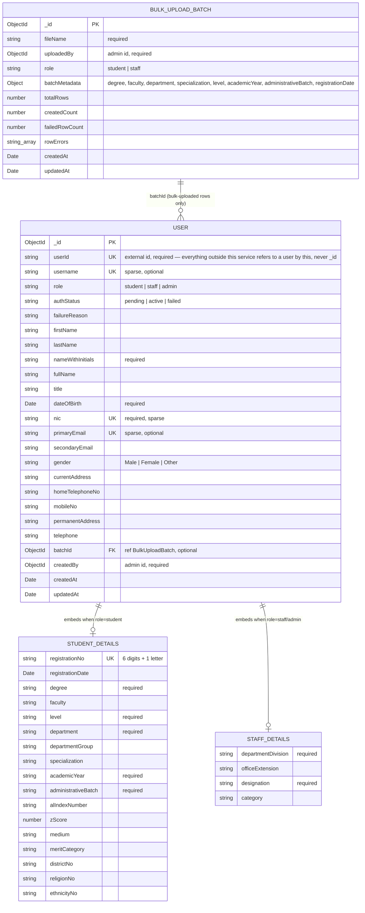

# User Management Service

Part of the UoM MIS microservices system. Owns student/staff/admin registration
(single-entry and bulk Excel/CSV upload), the `users` and `bulkUploadBatches`
MongoDB collections, and the async handshake with the Auth Service (Keycloak)
over RabbitMQ.

```
Admin/User SPA → API Gateway (Kong, HTTP) → User Management (this service, HTTP)
                                                   │
                                                   ├── MongoDB (own database)
                                                   │
                                                   └── RabbitMQ
                                                          ├─→ Auth Service (user-mgmt.commands, key user.register)
                                                          └─← Auth Service (auth.events, keys auth.user-mgmt.succeeded/.failed)

Auth Service separately publishes auth.notification.succeeded/.failed on
auth.events straight to Notification Service — this service is not on that
path at all, it only ever talks to Auth.
```

This service never calls Auth directly over HTTP — only through the RabbitMQ
contract in [§ RabbitMQ contract](#rabbitmq-contract). It has no channel to
Notification Service, direct or otherwise. Auth Service owns credentials
(Keycloak/LDAP); this service never stores a password.

## Tech stack

NestJS · MongoDB/Mongoose (`@nestjs/mongoose`) · RabbitMQ pub/sub
(`@golevelup/nestjs-rabbitmq`) · `class-validator`/`class-transformer` ·
`exceljs` (bulk upload parsing) · `jsonwebtoken` + `jwks-rsa` (JWT/JWKS) ·
`@nestjs/config` · Jest

## Running locally

```bash
# from the monorepo root
docker compose -f apps/user-management/docker-compose.yml up -d mongo rabbitmq
nest start user-management        # or: nest start user-management --watch
```

Config is loaded from `apps/user-management/.env` (see `.env.example` for the
full list — `MONGODB_URI`, `RABBITMQ_URI`, `KEYCLOAK_JWKS_URI`, `PORT`, plus
`TOKEN_VERIFIER_MODE`, a dev-only flag explained below).
`main.ts` loads this file explicitly (`join(process.cwd(), 'apps/user-management/.env')`)
before anything else in the import graph, because the RabbitMQ decorators
read `process.env` at class-decoration time — see the comment at the top of
`main.ts`.

Seed data: `seed.mongosh.js` (`mongosh <uri> seed.mongosh.js`) inserts a
handful of student/staff/admin documents across all three `authStatus` values.

## Folder-by-folder

### `config/configuration.ts`
Single `@nestjs/config` factory. Every env var the service reads goes through
here with a sane default — the one exception is `main.ts`'s final
`process.env.PORT ?? 3000` fallback (and the `dotenv` bootstrap at the very
top of `main.ts` itself, see below).

### `common/` — cross-cutting building blocks
- **`guards/token-verifier.interface.ts`** — the `TokenVerifier` interface
  (`verify(token) → { sub, roles, ... }`) and its DI token `TOKEN_VERIFIER`.
  Two implementations, picked by `TOKEN_VERIFIER_MODE`:
  - **`keycloak-jwks-token-verifier.ts`** — real implementation. Decodes the
    JWT header to get `kid`, fetches the matching signing key from
    `KEYCLOAK_JWKS_URI` via `jwks-rsa` (cached, rate-limited), then verifies
    the signature with `jsonwebtoken`. Roles come from Keycloak's
    `realm_access.roles` claim.
  - **`stub-token-verifier.ts`** — decodes the payload **without** checking
    the signature. `TOKEN_VERIFIER_MODE=stub` for local dev/tests so you don't
    need a running Keycloak — see [How to call it locally](#how-to-call-it-locally).
- **`guards/roles.guard.ts`** — `RolesGuard`, applied per-route via
  `@UseGuards(RolesGuard) @Roles('admin')`. Reads `Authorization: Bearer`,
  calls the injected `TokenVerifier`, 401s on a missing/invalid token, 403s if
  the required role isn't in the token's `roles`. On success it stashes the
  decoded payload on `req.user` for the controller to read.
- **`decorators/roles.decorator.ts`** — `@Roles(...roles)`, just
  `SetMetadata` under the hood; read back by `RolesGuard` via `Reflector`.
- **`filters/http-exception.filter.ts`** — global `@Catch()` filter. Normalizes
  every error response to `{ statusCode, path, timestamp, message }`, logs
  5xx with a stack trace.
- **`interceptors/logging.interceptor.ts`** — global interceptor, logs one
  structured JSON line per request (`method`, `url`, `statusCode`,
  `durationMs`).
- **`utils/admin-id.util.ts`** — `adminIdFromSub(sub)`. A Keycloak JWT `sub`
  is a UUID string, but the `User`/`BulkUploadBatch` schemas type
  `createdBy`/`uploadedBy` as Mongo `ObjectId` (this service has no local
  admin directory — Auth owns that). This deterministically hashes the sub
  into a 24-hex-char ObjectId so the same admin always maps to the same id.
- **`common.module.ts`** — wires `RolesGuard` and the `TOKEN_VERIFIER`
  provider (factory picks stub vs. JWKS based on config) and exports both.
  **Why this exists as its own module**: `RolesGuard`/`TOKEN_VERIFIER` are
  used by controllers in `UsersModule` and `BulkUploadModule`, which are
  siblings that `AppModule` imports — a module only gets access to what *it*
  imports, not to its parent's providers, so these can't just live on
  `AppModule`. (This was a real bug caught only by actually booting the app —
  see the note at the bottom of this file.)

### `users/` — registration + read endpoints
- **`schemas/user.schema.ts`** — the `users` Mongo collection. One schema for
  all three roles (`student | staff | admin`), discriminated by `role`, with
  `studentDetails`/`staffDetails` sub-schemas holding role-specific fields.
  `authStatus` starts `pending`, becomes `active`/`failed` once Auth replies.
  Password is never stored anywhere.
- **`dto/`** — `class-validator` DTOs: `CreateStudentDto`, `CreateStaffDto`
  (one endpoint handles both `staff` and `admin`, picked by `dto.role`),
  `UpdateUserDto` (deliberately excludes `username`/`role`/`authStatus` — not
  editable via `PATCH`), `QueryUsersDto` (list/search/filter + pagination).
- **`users.service.ts`** — the core logic:
  - `createPendingUser(input)` — writes the `pending` doc, then publishes
    `user.register`. If the publish fails, it's logged loudly and
    **rethrown** rather than swallowed — the caller sees a failed HTTP
    response instead of a silently orphaned pending document. (Bulk upload
    catches this per-row instead — see below.)
  - `finalizeAfterAuthentication(userId)` — called by the RabbitMQ consumer
    when Auth reports success. Sets `authStatus: active` (only while still
    `pending`, so a redelivered result is a no-op).
  - `recordAuthenticationFailure(userId, reason)` — called when Auth reports
    failure. Sets `authStatus: failed` + `failureReason`.
  - `list` / `findByUserId` / `update` — the read/patch endpoints.
- **`users.controller.ts`** — `POST /users/students`, `POST /users/staff`
  (both `admin`-guarded, return `202` + `userId`), `GET /users`,
  `GET /users/:id`, `PATCH /users/:id` (`admin`-guarded). Converts the JWT
  `sub` to `createdBy` via `adminIdFromSub`.
- **`users.module.ts`** — imports `CommonModule` (guard/verifier) and
  `MessagingModule` via `forwardRef` (genuine circular dependency: the
  RabbitMQ consumer needs `UsersService`, and `UsersService` needs the
  publisher — see `messaging.module.ts` below).

### `bulk-upload/` — Excel/CSV student registration
- **`schemas/bulk-upload-batch.schema.ts`** — the `bulkUploadBatches`
  collection: file metadata, batch-level defaults (degree/faculty/department/
  etc., applied to every row), and running totals (`totalRows`,
  `createdCount`, `failedRowCount`, `rowErrors`).
- **`parsers/excel-parser.service.ts`** — `exceljs`-based (not `xlsx`/SheetJS
  — that package has long-standing unpatched security advisories). Maps the
  *exact* column set from the real upload template (`COLUMN_MAP`, verbatim
  header names). Row 1 = headers, rows 2–3 = hints/annotations (skipped,
  never parsed), data starts row 4. If any "Must" column header is missing
  entirely, the whole file is rejected before any row is read. Otherwise
  every row is validated (Must-field presence, `registrationNo` format
  `\d{6}[A-Za-z]`, `DOB` format, `Gender` M/F, `Z-Score` numeric) and **if
  any row has an error, the entire batch is rejected — no `User` documents
  are created** (per spec: reject up front, not partial-import). The
  `BulkUploadBatch` doc is still written so the rejection is visible via the
  status endpoint.
- **`dto/bulk-upload-metadata.dto.ts`** — validates the batch-level form
  fields (`role`, `degree`, `department`, `level`, `academicYear`, etc.).
- **`bulk-upload.service.ts`** — `processUpload`: parses the file, and *if*
  parsing succeeded cleanly, creates one `pending` user per row via
  `UsersService.createPendingUser`, **wrapped in a per-row try/catch** so one
  row's publish failure (or a Mongoose validation failure — see the flagged
  spec gap below) doesn't abort the rest of the batch; it's logged and
  tallied into `failedRowCount`/`rowErrors` instead. `getBatchStatus`
  aggregates live `authStatus` counts across the batch's users (not just the
  parse-time counters) via a Mongo aggregation.
- **`bulk-upload.controller.ts`** — `POST /users/bulk-upload` (multipart:
  `file` + a **JSON-stringified** `batchMetadata` field — Nest's
  `ValidationPipe` can't auto-parse a JSON string buried in a multipart
  field, so this is parsed/validated manually with `plainToInstance` +
  `validate()` before being handed to the service). `GET /bulk-uploads/:batchId`.
- **Known spec gap, deliberately not silently resolved**: the upload
  template's column table doesn't mark `DOB` as "Must" even though the
  `User` schema requires `dateOfBirth`, and marks `Permanent address` as
  "Must" even though the schema doesn't require it. Rows missing `DOB` pass
  parse-time validation but fail at `User.create()` — caught per-row as
  described above rather than at the earlier file-level check. Worth
  confirming with whoever owns the spec.

### `messaging/` — RabbitMQ pub/sub
Two exchanges, both hardcoded constants shared with Auth/Notification via the
`@app/rabbitmq` lib (`libs/rabbitmq/src/contracts/constants/`), not env-driven:
`user-mgmt.commands` (direct) carries the registration command to Auth;
`auth.events` (topic) carries result events back out to User Management and
Notification, one per consumer via a routing-key/binding-key prefix each
consumer owns exclusively. `docs/rabbitmq_naming.md` at the repo root is the
authoritative naming convention both this service and Auth follow. Messages
are the plain command/event object, no envelope wrapper.

- **`user-registration.publisher.ts`** — `UserRegistrationPublisher`,
  publishes a `UserRegistrationRequestedCommand` with routing key
  `user.register` on `user-mgmt.commands` (fired once per user, right after
  the `pending` doc is created — both for single registration and each bulk
  row). No password is ever included; `primaryEmail`/`userName` are
  published as `''` when not known (bulk-uploaded students have no email
  column at all — this is a deliberate, spec-documented decision, not a bug).
- **`auth-result.consumer.ts`** — `AuthResultConsumer`, binds queue
  `user-mgmt.auth.result` on `auth.events` via the `auth.user-mgmt.*` binding
  key (one queue, both outcomes). On success calls
  `UsersService.finalizeAfterAuthentication`; on failure calls
  `UsersService.recordAuthenticationFailure`. Redelivery is handled without a
  separate idempotency ledger: `finalizeAfterAuthentication` only acts while
  `authStatus === 'pending'`, so a duplicate delivery for an already-finalized
  user is a silent no-op.
- **`messaging.module.ts`** — `RabbitMQModule.forRootAsync` (connection
  config from `ConfigService`), registers the publisher and consumer above.
  Imports `UsersModule` via `forwardRef` (mirrors `UsersModule`'s own
  `forwardRef` back to this module — the consumer needs `UsersService`, the
  publisher is needed by `UsersService`).

Notification Service is never on this service's messaging path — once Auth
issues credentials it publishes `auth.notification.succeeded`/`.failed`
straight to Notification on the same `auth.events` exchange.

### `health/health.controller.ts`
`GET /health` → `{ status: 'ok', timestamp }`. No module of its own —
registered directly on `AppModule`. Excluded from the global `api/v1` prefix
(see `main.ts`), so it's reachable at `/health`, not `/api/v1/health`.

### `main.ts`
Plain HTTP bootstrap (no Nest TCP microservice transport — an earlier
debugging session briefly had one, since removed; this service is reached
via plain HTTP through Kong, matching the API's `/api/v1/...` REST shape).
Sets the global prefix, a global `ValidationPipe` (whitelist + transform +
`forbidNonWhitelisted`), the exception filter, and the logging interceptor.

### `app.module.ts`
Root module: `ConfigModule` (global), `MongooseModule.forRootAsync`,
`MessagingModule`, `UsersModule`, `BulkUploadModule`, plus the standalone
`HealthController`.

## Database schema



`STUDENT_DETAILS`/`STAFF_DETAILS` aren't separate collections — they're
embedded sub-documents (`@Schema({ _id: false })`) nested directly inside a
`USER` doc, only one of the two populated depending on `role`. `batchId` only
exists on users created via bulk upload. There's no separate
idempotency-tracking collection — redelivery safety is handled in
`UsersService` itself (see `messaging/` below).

## API endpoints

All under `/api/v1` except `/health`. Write endpoints require
`Authorization: Bearer <jwt>` with an `admin` role.

| Method | Path | Guard | Purpose |
|---|---|---|---|
| POST | `/users/students` | admin | Register one student → `202` + `userId` |
| POST | `/users/staff` | admin | Register one staff/admin (role in body) → `202` + `userId` |
| POST | `/users/bulk-upload` | admin | Multipart Excel/CSV + `batchMetadata` JSON field |
| GET | `/users` | — | List/search/filter (`role`, `authStatus`, `batchId`, `search`, `page`, `limit`) |
| GET | `/users/:id` | — | Get one user |
| PATCH | `/users/:id` | admin | Update editable profile fields |
| GET | `/bulk-uploads/:batchId` | — | Batch progress + live authStatus counts |
| GET | `/health` | — | Liveness/readiness |

## RabbitMQ contract

Two exchanges, both defined in `libs/rabbitmq/src/contracts/constants/` and
shared with Auth/Notification via the `@app/rabbitmq` lib. See
`docs/rabbitmq_naming.md` at the repo root for the full naming convention.

| Exchange | Type | Direction |
|---|---|---|
| `user-mgmt.commands` | direct | published by us, consumed by Auth |
| `auth.events` | topic | published by Auth, consumed by us and by Notification |

| Routing key (publish) / binding key (consume) | Queue | Direction |
|---|---|---|
| `user.register` | `auth.user.register` | published by us → Auth |
| `auth.user-mgmt.succeeded` / `.failed`, bound via `auth.user-mgmt.*` | `user-mgmt.auth.result` | published by Auth → us |
| `auth.notification.succeeded` / `.failed`, bound via `auth.notification.*` | `notification.auth.result` | published by Auth → Notification (not this service) |

## How to call it locally

With `TOKEN_VERIFIER_MODE=stub`, the signature isn't checked — any
JWT-shaped token with `roles: ["admin"]` in the payload works:

```bash
HEADER=$(printf '{"alg":"none"}' | base64 | tr -d '=' | tr '/+' '_-')
PAYLOAD=$(printf '{"sub":"admin-1","roles":["admin"]}' | base64 | tr -d '=' | tr '/+' '_-')
TOKEN="${HEADER}.${PAYLOAD}.sig"

curl -X POST http://localhost:3000/api/v1/users/students \
  -H "Authorization: Bearer $TOKEN" -H "Content-Type: application/json" \
  -d '{ "...": "see users/dto/create-student.dto.ts for required fields" }'
```

## Testing

```bash
npx jest apps/user-management
```

`test/users.service.spec.ts`, `test/bulk-upload.service.spec.ts`,
`test/auth-result.consumer.spec.ts` — all pure unit tests, Mongoose
models/`AmqpConnection` mocked, no real Mongo/RabbitMQ required.

## Docker

`docker-compose.yml` (Mongo + RabbitMQ w/ management UI on `:15672` + this
service) and `Dockerfile` both live in this folder, but the Dockerfile's
build **context is the monorepo root** (`../..`) — this app shares one root
`package.json`/`node_modules` with `api-gateway`/`auth`/`notification`, not a
per-app install.
