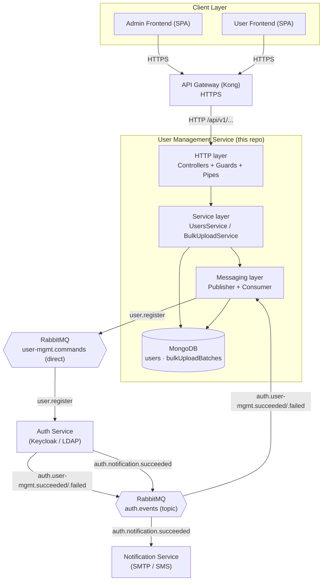
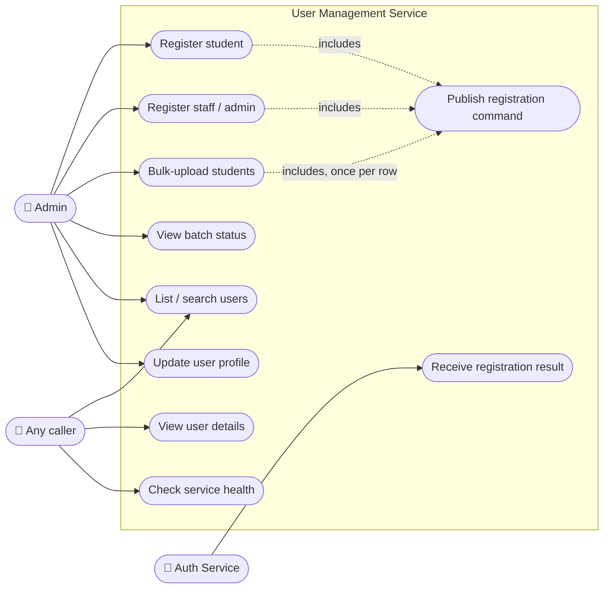
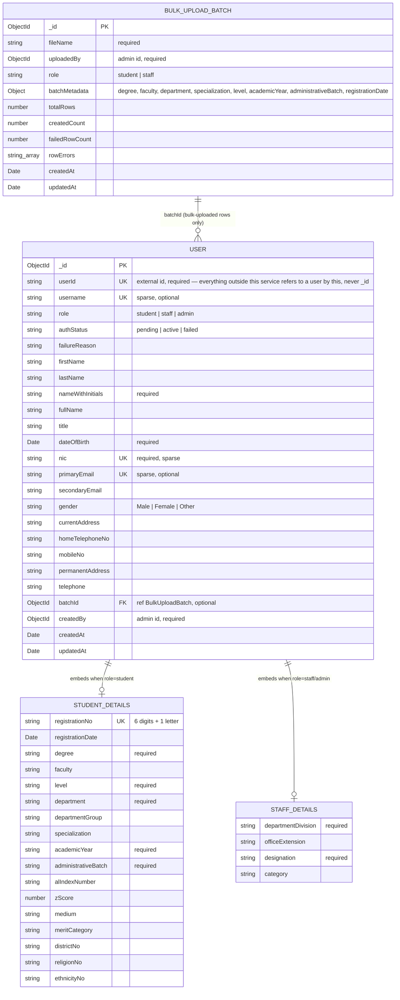
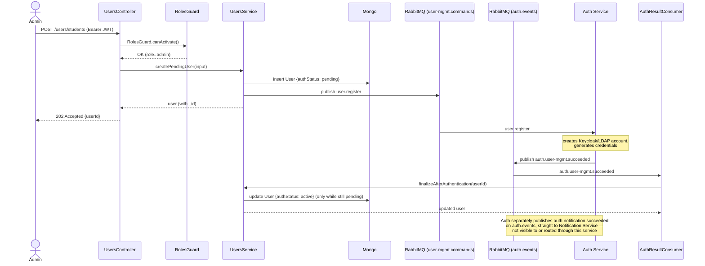
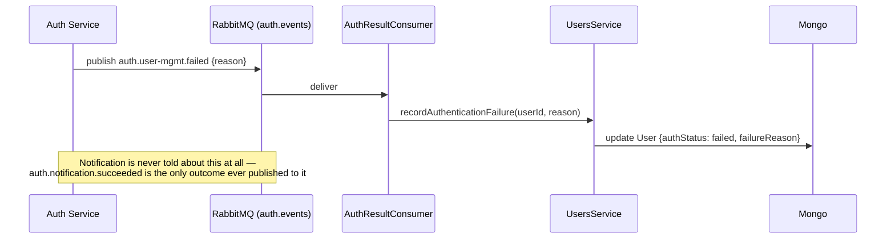
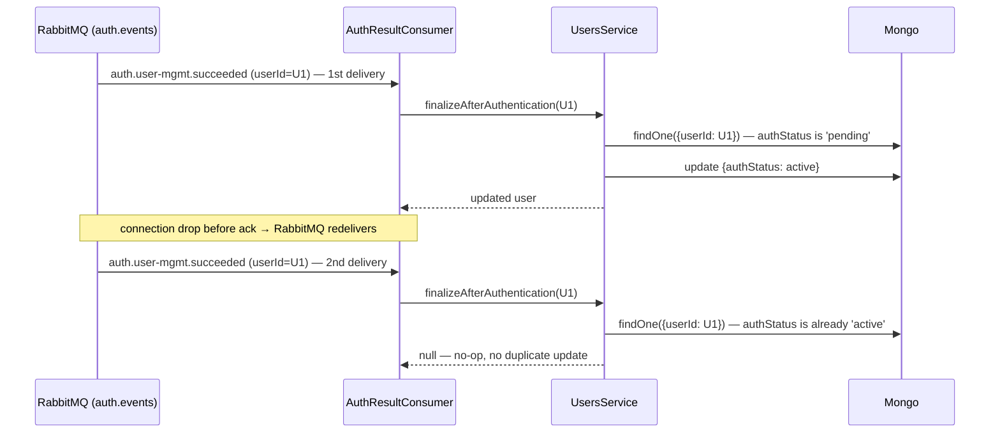
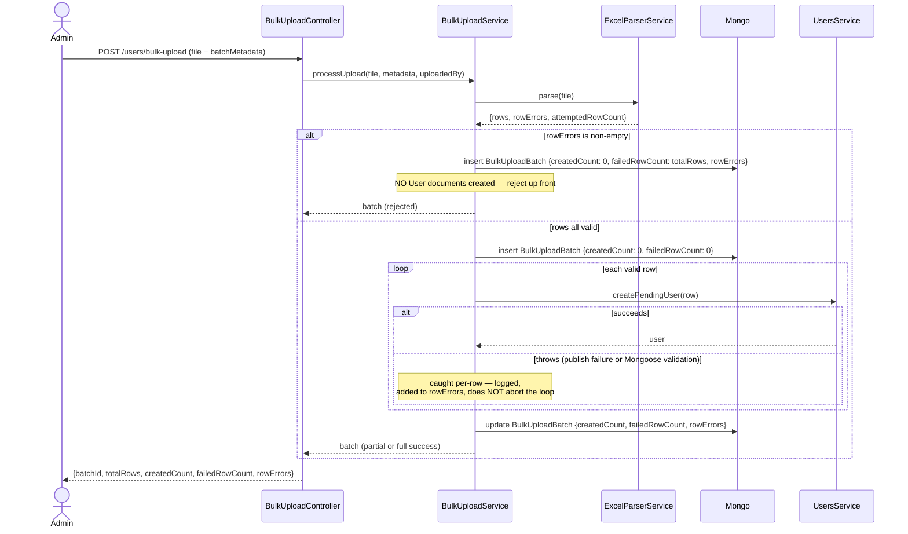
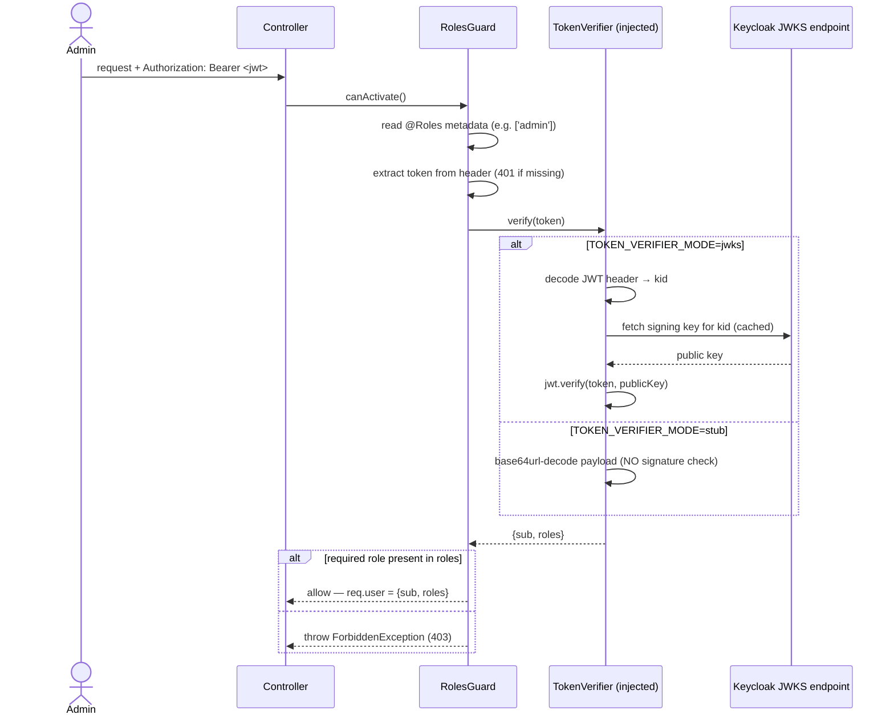
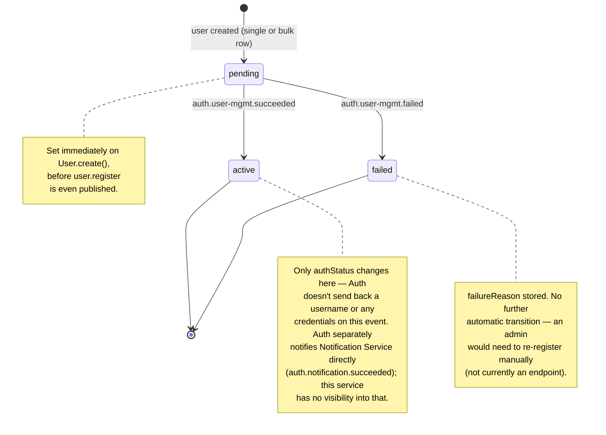

# User Management Service — Full Documentation

## 1. Purpose & Scope

The User Management Service is one of three microservices in the UoM MIS
event-driven backend (the other two — Auth Service and Notification Service —
are owned by other teams and are **not** built here). It owns:

- Student registration (single-entry and bulk Excel/CSV upload)
- Staff/admin registration (single-entry)
- The `users` and `bulkUploadBatches` MongoDB collections
- The async registration handshake with Auth Service over RabbitMQ

**Explicitly out of scope** (per the originating spec, confirmed not built here):
- Keycloak/LDAP integration itself (Auth Service owns this — we only verify
  JWTs against Keycloak's JWKS endpoint, we never talk to Keycloak/LDAP to
  create accounts)
- Actual email/SMS sending (Notification Service owns this — we only publish
  the event that tells it to)
- The Admin/User frontends
- API Gateway (Kong) configuration

This service never stores a password, and never calls Auth Service directly
over HTTP — the only channel to Auth is RabbitMQ (see
[§6](#6-rabbitmq-contract)). It has no channel to Notification Service at
all, direct or otherwise — Auth Service notifies it once credentials are
issued.

## 2. Architecture Overview



Key architectural decisions baked into this diagram:
- HTTP only exists between the client-facing Gateway and this service — every
  other microservice-to-microservice interaction is async, via RabbitMQ
  (`user-mgmt.commands` for the outbound command to Auth, `auth.events` for
  inbound results from Auth).
- This service owns its own MongoDB database exclusively — no other service
  reads or writes it directly.
- This service and Notification Service never talk to each other, directly or
  over RabbitMQ — Auth Service is the only thing either of them talks to.

## 3. Actors & Use Cases

**Actors**:
- **Admin** — the only human actor that calls this service directly (via the
  Gateway); authenticated as `role: admin` in their JWT.
- **Auth Service** — external system, replies asynchronously via RabbitMQ.
  (Notification Service is not an actor here — it's notified by Auth Service
  directly and never interacts with this service in any way.)
- **Anyone (unauthenticated)** — read endpoints (`GET /users`, `GET /users/:id`,
  `GET /bulk-uploads/:batchId`, `GET /health`) require no token today; see
  [§9 Known limitations](#9-known-limitations--spec-gaps) for the caveat.



Notification Service isn't an actor here — it never interacts with this
service in any way; Auth Service notifies it directly once credentials are
issued.

### Use case narratives

| Use case | Trigger | Outcome |
|---|---|---|
| Register student | Admin submits single-student form | `pending` user created, `user.register` published, `202` returned with `userId` |
| Register staff/admin | Admin submits single staff/admin form | Same as above, `role` taken from the request body |
| Bulk-upload students | Admin uploads Excel/CSV + batch metadata | File parsed and validated up front; on any row error, **zero** users are created and the batch records the rejection; otherwise one `pending` user + one publish per valid row |
| View batch status | Admin (or anyone) queries a `batchId` | Batch totals + live `authStatus` counts across the batch's users |
| List / search users | Any caller, with filters | Paginated list |
| View user details | Any caller, by `id` | Single user document |
| Update user profile | Admin, by `id` | Editable fields only — not `username`/`role`/`authStatus` |
| Check service health | Any caller | Liveness probe |
| Publish registration command | Internal — fired by the three registration use cases | `user.register` command on `user-mgmt.commands` |
| Receive registration result | Auth Service replies async on `auth.events` | `authStatus` updated to `active`/`failed`; redelivery-safe (no-op once no longer `pending`) |

## 4. Database Schema (ERD)



`STUDENT_DETAILS`/`STAFF_DETAILS` are embedded sub-documents
(`@Schema({ _id: false })`), not separate collections — only one is populated
per user, depending on `role`. `batchId` only exists on bulk-uploaded users.
There's no separate idempotency-tracking collection — redelivery safety is
handled in `UsersService` itself (see `messaging/` in [§7](#7-module-reference)).

## 5. Sequence Diagrams

### 5.1 Single registration — success path



### 5.2 Single registration — Auth Service rejects it



### 5.3 Redelivery — how duplicates are handled

There's no separate idempotency-tracking collection or event-id ledger —
redelivery safety comes from `finalizeAfterAuthentication` only acting while
the user's `authStatus` is still `pending`.



### 5.4 Bulk upload — parse failure vs. partial row failure



### 5.5 RBAC — token verification (stub vs. JWKS)



## 6. State Diagram — `authStatus` lifecycle



## 7. Module Reference

| Path | Responsibility |
|---|---|
| `config/configuration.ts` | Single `@nestjs/config` factory — every env var flows through here |
| `common/guards/token-verifier.interface.ts` | `TokenVerifier` interface + DI token |
| `common/guards/keycloak-jwks-token-verifier.ts` | Real JWT verification via `jsonwebtoken` + `jwks-rsa` |
| `common/guards/stub-token-verifier.ts` | Unsigned decode, local dev/test only |
| `common/guards/roles.guard.ts` | `RolesGuard` — the actual per-route auth enforcement |
| `common/decorators/roles.decorator.ts` | `@Roles(...)` metadata decorator |
| `common/filters/http-exception.filter.ts` | Normalizes all error responses |
| `common/interceptors/logging.interceptor.ts` | One structured JSON log line per request |
| `common/utils/admin-id.util.ts` | Maps a Keycloak `sub` (UUID) → deterministic Mongo `ObjectId` |
| `common/common.module.ts` | Wires `RolesGuard` + `TOKEN_VERIFIER`, exported to whoever needs them |
| `users/schemas/user.schema.ts` | The `users` collection |
| `users/dto/*.ts` | Request validation for all `/users/*` endpoints |
| `users/users.service.ts` | Core logic: create-pending, finalize/record auth result, list/find/update |
| `users/users.controller.ts` | `/users/*` HTTP routes |
| `users/users.module.ts` | Wires the above; `forwardRef` to `MessagingModule` |
| `bulk-upload/schemas/bulk-upload-batch.schema.ts` | The `bulkUploadBatches` collection |
| `bulk-upload/parsers/excel-parser.service.ts` | Column-mapped Excel/CSV parsing + row validation |
| `bulk-upload/dto/bulk-upload-metadata.dto.ts` | Validates the multipart `batchMetadata` field |
| `bulk-upload/bulk-upload.service.ts` | Orchestrates parse → per-row create → batch status |
| `bulk-upload/bulk-upload.controller.ts` | `/users/bulk-upload`, `/bulk-uploads/:batchId` |
| `bulk-upload/bulk-upload.module.ts` | Wires the above |
| `messaging/user-registration.publisher.ts` | `UserRegistrationPublisher` — publishes `user.register` on `user-mgmt.commands` |
| `messaging/auth-result.consumer.ts` | `AuthResultConsumer` — consumes `auth.user-mgmt.succeeded`/`.failed` off `auth.events` |
| `messaging/messaging.module.ts` | `RabbitMQModule.forRootAsync` + wires the publisher and consumer above |
| `libs/rabbitmq/src/contracts/` (shared lib, not in this app) | Exchange/queue/routing-key constants + event payload interfaces, shared with Auth/Notification — see `docs/rabbitmq_naming.md` at the repo root |
| `health/health.controller.ts` | `GET /health` |
| `main.ts` | Bootstrap — loads `.env`, global prefix, pipes, filter, interceptor |
| `app.module.ts` | Root module composition |

(Full prose walkthrough of every file, including the "why" behind several
non-obvious decisions, is in `../README.md` — this table is the map, that's
the terrain.)

## 8. API Reference

Base path `/api/v1` (except `/health`). Write endpoints require
`Authorization: Bearer <jwt>` with `admin` in the token's `roles`.

### `POST /users/students` — admin

Request body (`CreateStudentDto`):
```json
{
  "firstName": "Amal",
  "lastName": "Perera",
  "nameWithInitials": "A.B. Perera",
  "fullName": "Amal Bandara Perera",
  "title": "Mr",
  "dateOfBirth": "2003-01-15",
  "nic": "200301501234",
  "primaryEmail": "amal.perera@example.com",
  "secondaryEmail": "amal.p@gmail.com",
  "gender": "Male",
  "currentAddress": "12 Lake Drive, Colombo",
  "homeTelephoneNo": "0112345678",
  "mobileNo": "0771234567",
  "permanentAddress": "12 Lake Drive, Colombo",
  "telephone": "0112345678",
  "studentDetails": {
    "registrationNo": "200301A",
    "registrationDate": "2025-09-01",
    "degree": "BSc Eng",
    "faculty": "Engineering",
    "level": "L1",
    "department": "CSE",
    "departmentGroup": "Group A",
    "specialization": "Software Engineering",
    "academicYear": "2025/2026",
    "administrativeBatch": "2025",
    "alIndexNumber": "1234567",
    "zScore": 1.8532,
    "medium": "English",
    "meritCategory": "District",
    "districtNo": "11",
    "religionNo": "01",
    "ethnicityNo": "02"
  }
}
```
Required: `firstName`, `lastName`, `nameWithInitials`, `dateOfBirth`, `nic`,
`primaryEmail`, `studentDetails.{registrationNo, degree, level, department,
academicYear, administrativeBatch}`. Everything else optional.

Response `202 Accepted`:
```json
{ "userId": "6a4f6aa82749314f41ce024d" }
```

### `POST /users/staff` — admin

Same shape, `role: "staff" | "admin"` in the body, `staffDetails` instead of
`studentDetails` (`departmentDivision`, `officeExtension?`, `designation`,
`category?`).

### `POST /users/bulk-upload` — admin

Multipart form: `file` (`.xlsx`/`.csv`) + `batchMetadata` (JSON-stringified):
```json
{
  "role": "student",
  "degree": "BSc Eng",
  "faculty": "Engineering",
  "department": "CSE",
  "specialization": "Software Engineering",
  "level": "L1",
  "academicYear": "2025/2026",
  "administrativeBatch": "2025",
  "registrationDate": "2025-09-01"
}
```
Required: `role` (currently only `student` is actually processed —
`staff` is rejected with `400`, see [§9](#9-known-limitations--spec-gaps)),
`department`, `level`, `academicYear`, `administrativeBatch`.

Response:
```json
{
  "batchId": "6a55c4120629bcd1e54eeb86",
  "totalRows": 12,
  "createdCount": 11,
  "failedRowCount": 1,
  "rowErrors": ["Row 9: broker unreachable — Auth Service could not be notified"]
}
```

### `GET /users` — no auth required

Query params: `role`, `authStatus`, `batchId`, `search`, `page` (default 1),
`limit` (default 20).

### `GET /users/:id` — no auth required
### `PATCH /users/:id` — admin

Body (`UpdateUserDto`, all optional): `firstName`, `lastName`,
`nameWithInitials`, `fullName`, `title`, `primaryEmail`, `secondaryEmail`,
`gender`, `currentAddress`, `homeTelephoneNo`, `mobileNo`,
`permanentAddress`, `telephone`. **Not** editable: `username`, `role`,
`authStatus`.

### `GET /bulk-uploads/:batchId` — no auth required

```json
{
  "batch": { "_id": "...", "fileName": "...", "totalRows": 12, "createdCount": 11, "failedRowCount": 1, "rowErrors": [] },
  "authStatusCounts": { "pending": 2, "active": 8, "failed": 1 }
}
```

### `GET /health`

```json
{ "status": "ok", "timestamp": "2026-07-14T09:32:13.005Z" }
```

## 9. Known Limitations & Spec Gaps

- **Read endpoints are unauthenticated.** `GET /users`, `GET /users/:id`, and
  `GET /bulk-uploads/:batchId` have no guard, matching the spec's literal "on
  all *write* endpoints" — worth confirming this is actually intended before
  shipping, since `GET /users` currently returns full PII (NIC, DOB, address,
  phone) to anyone who can reach the service.
- **Bulk upload is student-only.** The spec says it should be "structured so
  it can be reused for staff later" — the schema and `BulkUploadBatch.role`
  already allow `staff`, but `BulkUploadService.processUpload` throws `400`
  for anything other than `student` today; the Excel column map is
  student-specific.
- **`DOB` vs. schema requirement mismatch.** The upload template's column
  table doesn't mark `DOB` as "Must" even though `User.dateOfBirth` is
  `required: true`, and marks `Permanent address` as "Must" even though the
  schema doesn't require it. Rows missing `DOB` pass the parser's row
  validation but fail at `User.create()` — caught per-row (doesn't abort the
  batch) rather than at the earlier file-level check.
- **Failed registrations have no retry endpoint.** Once `authStatus: failed`,
  there's no built-in way to re-trigger `user.register` — an admin would need
  to re-register the user from scratch (a new document).
- **`username` is never actually populated by the registration-result flow.**
  The `User` schema has a `username` field, but `AuthResultConsumer` /
  `finalizeAfterAuthentication` only ever update `authStatus` on success —
  nothing currently writes `username`. Assignment/format ownership is still
  unconfirmed with the Auth team.

## 10. Non-Functional Requirements Coverage

| Requirement | How it's met |
|---|---|
| DTO validation, 400 on failure | Global `ValidationPipe` (`whitelist`, `transform`, `forbidNonWhitelisted`) |
| Publish failure ≠ silent orphan | Single registration: rethrown, surfaces as a failed HTTP response. Bulk: caught per-row, tallied into `rowErrors`/`failedRowCount`, visible via the status endpoint |
| Structured JSON logging | `LoggingInterceptor` (per-request) + every service/consumer logs `JSON.stringify({...})` with `correlationId` where relevant |
| `.env.example` | Present, all 4 required vars + 1 dev-only flag |
| Unit tests | `UsersService`, `BulkUploadService`, `AuthResultConsumer` — 17 tests, Mongo/AMQP mocked |
| `docker-compose.yml` for local dev | Mongo + RabbitMQ (management UI) + this service |

## 11. Environment Variables

| Variable | Default (if unset) | Purpose |
|---|---|---|
| `MONGODB_URI` | `mongodb://localhost:27017/user-management` | Mongo connection string |
| `RABBITMQ_URI` | `amqp://localhost:5672` | RabbitMQ connection string |
| `KEYCLOAK_JWKS_URI` | *(empty — throws if used in `jwks` mode)* | JWKS endpoint for real token verification |
| `PORT` | `3000` | HTTP listen port |
| `TOKEN_VERIFIER_MODE` | `jwks` | `stub` (no signature check, local dev/test) or `jwks` (real Keycloak verification) |

Exchange, queue, and routing/binding key names are hardcoded constants shared
with Auth/Notification via the `@app/rabbitmq` lib
(`libs/rabbitmq/src/contracts/constants/`) — not configurable via env var.

## 12. Testing

```bash
npx jest apps/user-management
```

`test/users.service.spec.ts`, `test/bulk-upload.service.spec.ts`,
`test/auth-result.consumer.spec.ts` — 17 pure unit tests. Mongoose models and
`AmqpConnection` are mocked; no real Mongo/RabbitMQ needed to run them.

## 13. Deployment

`docker-compose.yml` + `Dockerfile` live in `apps/user-management/`, but the
Dockerfile's build **context is the monorepo root** (`../..`) since this app
shares one root `package.json`/`node_modules` with `api-gateway`/`auth`/
`notification` — not a per-app install.

```bash
docker compose -f apps/user-management/docker-compose.yml up -d
```

Brings up Mongo, RabbitMQ (management UI on `:15672`), and the service itself
on `:3000`, with `TOKEN_VERIFIER_MODE=stub` by default (no real Keycloak
needed to call the API locally) — override it via env for anything
resembling a real deployment. A real Auth Service still needs to be running
(or reachable) for the RabbitMQ round-trip itself to complete.

## 14. Troubleshooting Log (real issues hit while building this)

Kept here as institutional memory — these are exactly the kind of thing that
re-bites the next person who touches this service.

1. **`jose@6` is ESM-only, crashes CommonJS webpack build with
   `ERR_REQUIRE_ESM`.** Worse, `jwks-rsa@4.x` depends on `jose@^6` internally,
   so the crash resurfaced one dependency layer down even after removing our
   own `jose` import. Fixed by using `jsonwebtoken` + `jwks-rsa@^3.2.2`
   (pinned below 4.x, which depends on `jose@^4` — the last dual CJS/ESM
   release).
2. **`RolesGuard`/`TOKEN_VERIFIER` registered on `AppModule`, but consumed by
   controllers in sibling modules (`UsersModule`, `BulkUploadModule`).**
   Nest's DI doesn't grant a module access to its *parent's* providers, only
   to what it explicitly imports — this crashed on boot with
   `Nest can't resolve dependencies of RolesGuard`, only caught by actually
   starting the app (not by unit tests or the build). Fixed by extracting
   `CommonModule`, imported by both.
3. **`exceljs`'s own `index.d.ts` declares `interface Buffer extends
   ArrayBuffer {}`**, a module-local shadow of the real Buffer type that
   breaks structural typing for `workbook.xlsx.load(buffer)`. Not a
   dependency-version conflict (ruled out by deduping `@types/node`) — an
   upstream defect in exceljs's own types. Fixed with a targeted `as any` at
   that one call site.
4. **Cross-drive `node_modules` resolution failure** when a throwaway test
   script lived outside the repo (`C:\...\Temp\...` vs. the repo on `D:\...`)
   — Node resolves `node_modules` by walking up from the script's own path,
   so it never found the repo's dependencies. Any ad-hoc script needs to live
   inside the repo to resolve its packages.
5. **`EADDRINUSE` port collisions** happened repeatedly during iterative dev
   — a background instance from a previous test run left the port held while
   a new `nest start` tried to bind it. Not a code bug; just a reminder to
   check `Get-NetTCPConnection -LocalPort <port>` before assuming a fresh
   start failed for a real reason.
